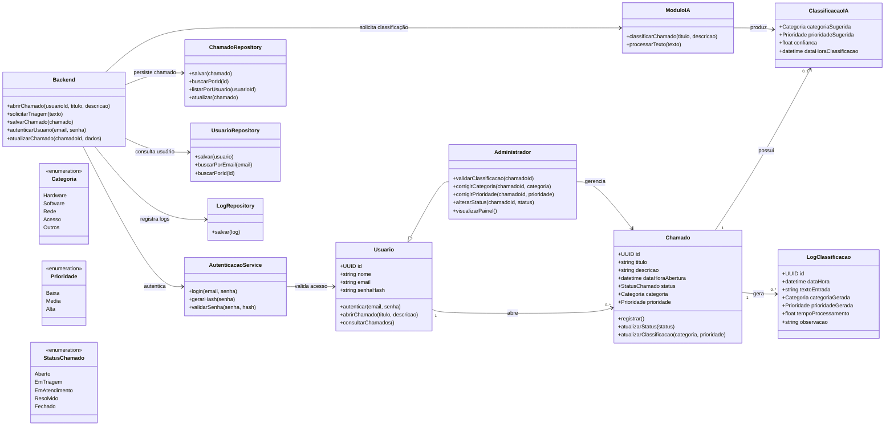
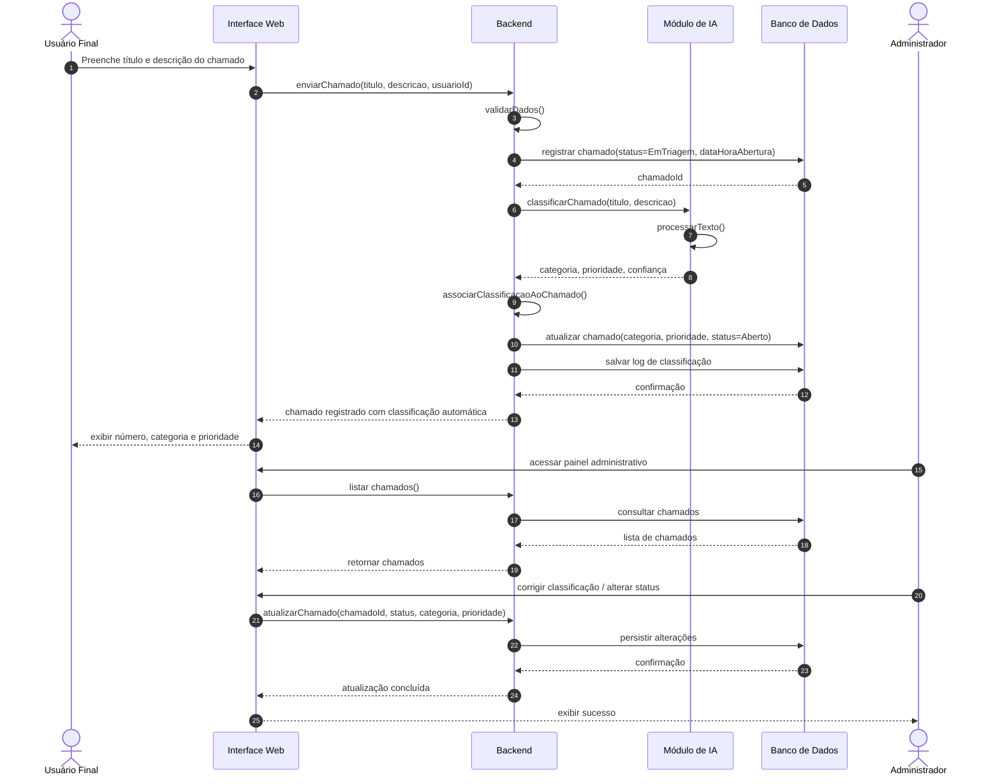
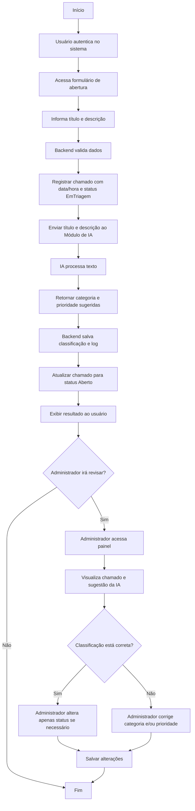
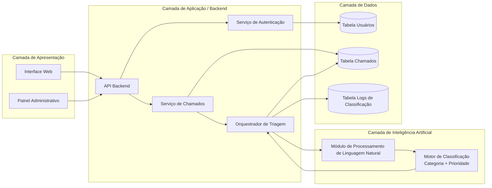

DECLARAÇÃO DE ESCOPO DO PROJETO

1. Identificação do Projeto

Nome do Projeto: Sistema de Help Desk com Triagem Automática de Chamados utilizando Inteligência Artificial
Disciplina: Engenharia de Software
Tipo de Projeto: Projeto acadêmico de desenvolvimento de software

2. Descrição Geral do Escopo

Este documento tem como objetivo definir claramente o escopo do projeto, descrevendo as entregas, funcionalidades, critérios de aceitação, restrições e exclusões.
A Declaração de Escopo estabelece os limites do projeto, garantindo alinhamento entre as expectativas do aluno desenvolvedor e os critérios de avaliação da disciplina, evitando ambiguidades e expansão não controlada do escopo (scope creep).

3. Entregas do Projeto (Deliverables)

3.1 Entregas Principais

Documento TAP (Termo de Abertura do Projeto) Cronograma inicial com marcos (Gantt) Declaração de Escopo Estrutura Analítica do Projeto (EAP / WBS) Documento de Requisitos Funcionais e Não Funcionais Diagramas do sistema (casos de uso, classes e arquitetura) Protótipo funcional do sistema de Help Desk Módulo de Triagem Automática de Chamados com IA Relatório de testes e validação Documentação final do projeto 

4. Funcionalidades e Requisitos do Sistema

4.1 Requisitos Funcionais

RF01 – Permitir cadastro e autenticação de usuários RF02 – Permitir abertura de chamados com descrição textual RF03 – Classificar automaticamente chamados por categoria utilizando IA RF04 – Classificar automaticamente chamados por nível de prioridade RF05 – Permitir visualização e acompanhamento do status do chamado RF06 – Permitir que administradores visualizem e gerenciem chamados RF07 – Permitir atualização do status do chamado (aberto, em andamento, resolvido) 

4.2 Requisitos Não Funcionais

RNF01 – O sistema deve possuir interface simples e intuitiva RNF02 – O tempo de resposta da triagem automática deve ser adequado para uso acadêmico RNF03 – O sistema deve ser desenvolvido utilizando tecnologias gratuitas ou open-source RNF04 – O sistema deve ser acessível via navegador web RNF05 – O código-fonte deve seguir boas práticas de organização e versionamento 

5. Critérios de Aceitação

5.1 Critérios Gerais

Todas as funcionalidades descritas nos requisitos funcionais devem estar implementadas O sistema deve permitir a abertura e triagem automática de chamados O módulo de IA deve classificar chamados de forma demonstrável O sistema deve estar funcional em ambiente local ou acadêmico A documentação exigida pela disciplina deve estar completa e organizada 

5.2 Critérios de Aceitação da Triagem Automática

O sistema deve atribuir automaticamente uma categoria ao chamado O sistema deve atribuir automaticamente uma prioridade ao chamado A classificação deve ser visível para o usuário e para o administrador O funcionamento da triagem deve ser demonstrável durante apresentação ou demo 

6. Restrições do Projeto

O projeto será desenvolvido por um único aluno O prazo de desenvolvimento está limitado ao semestre letivo Não haverá investimento financeiro no projeto A base de dados utilizada será simulada ou reduzida O sistema será desenvolvido exclusivamente para fins acadêmicos 

7. Exclusões do Escopo (Fora do Escopo)

Integração com sistemas corporativos reais (ex: ServiceNow, Jira) Envio de notificações por e-mail, SMS ou aplicativos externos Implementação de SLAs reais ou contratos de atendimento Uso do sistema em ambiente de produção Autenticação avançada (SSO, OAuth corporativo) Monitoramento em tempo real ou alta disponibilidade 

8. Premissas

O usuário fornecerá corretamente as informações do chamado O módulo de IA terá caráter demonstrativo, não comercial O ambiente de execução será local ou acadêmico O professor atuará como avaliador e cliente do projeto 

9. Controle de Escopo

Qualquer solicitação de alteração no escopo deverá ser avaliada considerando o impacto no prazo e nas entregas do projeto, podendo ser recusada caso comprometa os objetivos acadêmicos estabelecidos nesta Declaração de Escopo.

## 1. Diagrama de Classes

### Refinamentos aplicados
- **Administrador herda de Usuario**, como você pediu.
- A **IA não substitui o backend**: ela é um módulo isolado, chamado pela classe `Backend`.
- A entidade `ClassificacaoIA` foi separada do `Chamado` para deixar explícita a origem da classificação automática.
- `LogClassificacao` ajuda a justificar a camada de dados e auditoria da IA.
- Foram incluídos enums de **Categoria**, **Prioridade** e **StatusChamado** para fortalecer a modelagem.

---

## 2. Diagrama de Sequência

Fluxo principal: abertura de chamado com triagem automática por IA.

### Pontos fortes deste fluxo
- Mostra claramente que o **backend coordena tudo**.
- O chamado pode ser criado inicialmente com status **EmTriagem** e depois atualizado para **Aberto** após resposta da IA.
- O administrador entra depois para **validar/corrigir** a sugestão da IA.

---

## 3. Diagrama de Atividades

Fluxo de abertura e tratamento do chamado com decisão sobre ajuste administrativo.

### Observações
- Esse diagrama enfatiza bem o **processo de negócio**.
- A revisão administrativa ficou opcional, o que combina com sua proposta de triagem automática.
- O ponto de integração com IA aparece de forma objetiva.

---

## 4. Diagrama de Componentes

Modelagem da arquitetura em 4 camadas, com destaque para a integração Backend ↔ IA.

### O que este diagrama deixa claro
- A **Interface Web** e o **Painel Administrativo** consomem a **API Backend**.
- O **Backend** contém autenticação, gestão de chamados e um **orquestrador** para a triagem.
- O **Módulo de IA** está isolado, mas conectado ao backend.
- O backend persiste tanto o chamado quanto os **logs da classificação**.

---

## Sugestões de melhoria para sua entrega acadêmica

Se você quiser deixar os diagramas ainda mais consistentes com documentação formal, recomendo:

1. **Padronizar nomes dos status**
   - Ex.: `Aberto`, `Em Triagem`, `Em Atendimento`, `Resolvido`, `Fechado`.

2. **Adicionar confiança da IA**
   - Isso enriquece a justificativa de por que o administrador pode revisar uma classificação.

3. **Explicitar restrição de desempenho**
   - No texto do trabalho, cite que o módulo de IA deve responder em até **3 segundos**.
   - Em alguns casos, isso pode aparecer como nota no diagrama de componentes.

4. **Manter a segurança fora do diagrama de classes principal**
   - A autenticação pode aparecer como serviço, sem poluir demais a modelagem de domínio.

---

## Versão resumida da interpretação conceitual

- **Classes**: modelam entidades e serviços.
- **Sequência**: mostra a ordem da abertura do chamado e da triagem automática.
- **Atividades**: representa o fluxo operacional do processo.
- **Componentes**: evidencia a arquitetura em 4 camadas.

Descrição do Projeto para Refinamento de Modelagem
Título: Sistema de Help Desk com Triagem Automática de Chamados (IA).
1. Objetivo Geral:
Desenvolver uma ferramenta acadêmica de Help Desk que utilize Inteligência Artificial para otimizar o fluxo de atendimento. O foco principal é a triagem automática, que elimina a necessidade de classificação manual imediata por parte do administrador.  
2. Atores e Personas:
• Usuário Final: Funcionário que abre chamados técnicos para resolver problemas rapidamente.  
• Administrador: Responsável por gerenciar o volume de chamados, podendo validar ou corrigir a IA.  
• Sistema de IA: Atua como um ator interno que realiza o processamento textual para classificação.  
3. Requisitos Funcionais Chave:
• Abertura e Triagem (RF03/RF04): O usuário fornece título e descrição; o sistema registra data/hora e executa o módulo de IA.  
• Classificação por IA: O sistema deve atribuir automaticamente uma Categoria e um nível de Prioridade (Baixa, Média, Alta).  
• Gestão Administrativa (RF06): O administrador tem o poder de alterar o status do chamado e ajustar as classificações sugeridas pela IA.  
4. Arquitetura do Sistema (4-Tier):
• Apresentação: Interface Web para interação do usuário e painéis administrativos.  
• Aplicação (Backend): Camada de lógica de negócio, controle de autenticação e ponte para o módulo de IA.  
• Inteligência Artificial: Módulo isolado de processamento de linguagem natural para classificação textual.  
• Dados: Banco de dados relacional para persistência de usuários, chamados e logs.  
5. Regras de Negócio e Restrições Técnicas:
• Segurança: Autenticação obrigatória com senhas criptografadas via algoritmos de hash (ex: bcrypt).  
• Desempenho: A triagem pela IA deve ocorrer em no máximo 3 segundos.  
• Escopo: O sistema é focado em ambiente acadêmico, sem integrações externas (como e-mail ou Slack) nesta fase.
